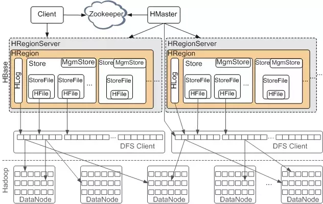

# Hbase

## 架构




HReginServer负责数据存储

一张表的逻辑视图

| rowkey | timestamp | base:name | base:age | contact:phone |
| ------ | --------- | --------- | -------- | ------------- |
| 1      | 1         | zhangsan  | 12       | 123           |
| 1      | 2         | zhangsan1 | 13       | 123           |
| 2      | 1         | lisi      | 10       | 345           |

冒号前是Column Family，冒号后是Qualifier，每个行都有相同的CF，但是每个CF的qualifier是多样的。rowkey是多版本的(timestamp标识，默认为写入Region Server的时间戳)，过期的版本会在compact时删除。

每个CF单独存储在StoreFile上，rowkey按照顺序分布在Region Server上，建议将rowkey打散，避免访问集中到固定几台Region Server，导致服务不可用。一种常用的方式是给rowkey增加md5前缀。

Hbase无法像redis一样提供单机高QPS的访问能力，如果有热key，建议使用本地缓存(如LRU)或者redis存放这些热key以缓解Hbase压力。

Hbase最小的存储单元为Block，默认为64K，如果一个rowkey的数据超过了64K可能会引起访问超时，即使不访问大的rowkey，也可能发生超时(访问相邻的rowkey？)

## LSM tree

Hbase等大数据KV系统的索引结构采用的是LSM树，传统B+树在更新数据时，磁盘会随机写入，很慢，LSM树把磁盘随机写改成顺序写，提高写入速度。

LSM树的结构如下，查询时按照从上到下进行查询。

````shell
内存表（MemTable，有序列表，skipList）
    ↓ flush（内存满了进行flush，flush后内存表清空）
磁盘文件 Level 0（不可修改的有序文件-SSTable集合，每次flush后生成新的SSTable，查询时按照新到旧查询）
    ↓ merge（满了触发merge）
磁盘文件 Level 1（同理Level 0）
    ↓ merge
磁盘文件 Level 2
````

更新、删除会被新增一个log，从上到下，从新到旧的查询顺序保证了会查到最新的log，即最新的数据。

代价是查询速度慢，因为会查询多层（如果数据一直没有找到），可以通过Bloom Filter解决，如果Bloom Filter判定数据不存在，则不用找了，直接返回没有。
