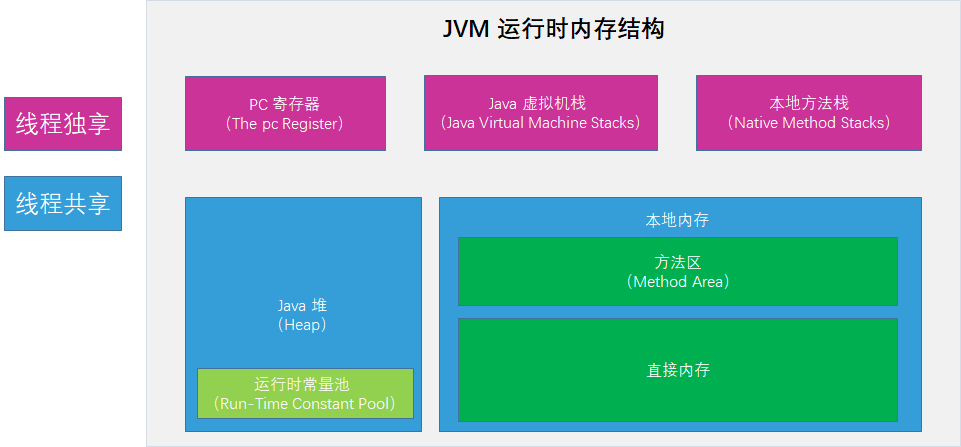
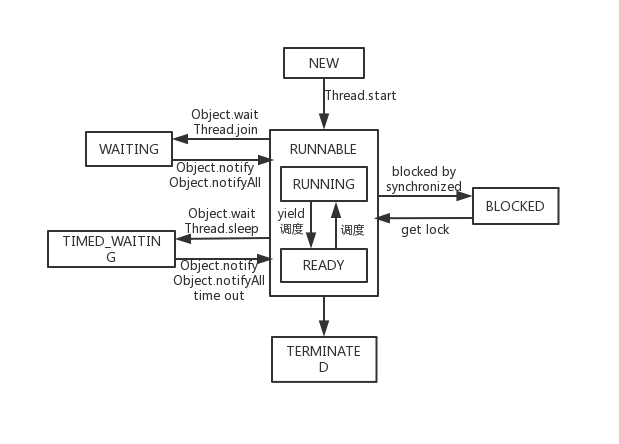
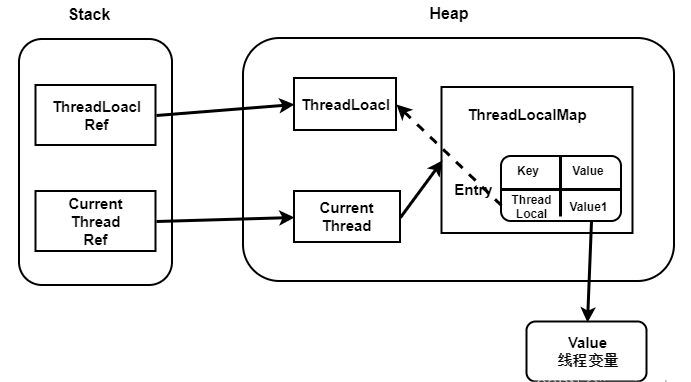

# 1. JVM结构

在程序执行期间，JVM维护了若干运行时数据区(run-time data area)，有些数据区是JVM启动时创建的，当JVM退出时销毁，有些数据区是分配给线程的，随着线程创建/销毁而创建/销毁。JDK8去掉了PermGen，取而代之的是在本地内存中的MetaSpace。

JVM运行时结构：https://www.cnblogs.com/jhxxb/p/10896386.html




# 2. 加载，链接，初始化

## 2.1. 加载

上图描述了JVM ClassLoader的工作方式：将.class文件中的字节码加载到代码区，然后在Method Area中创建Class对象，用于创建对象。ClassLoader一共分为4种：

- BootStrap ClassLoader：C++实现，负责加载jdk/jre/lib目录，或-Xbootclasspath指定的目录。
- Extension ClassLoader：实现在`sun.misc.Launcher$ExtClassLoader`，负责加载jdk/jre/lib/ext目录。
- Application ClassLoader：实现在`sun.misc.Launcher$AppClassLoader`，负责加载应用程序。
- User ClassLoader：开发人员实现，继承ClassLoader，加载通过IO等方式获取的代码。

### 2.1.1. 双亲委派模型

JVM通过双亲委派模型加载类，工作方式如下：

```java
Class loadClass(String name) {
    // 检查是否已经被加载
    Class c = findLoadedClass(name);
    if (c == null) {
        if (parent != null) {
            // 交给父类加载，父类调用loadClass加载
            c = parent.loadClass(name, false);
        } else {
            // parent是null，则为BootStrap ClassLoader，调用findBootstrapClassOrNull加载
            c = findBootstrapClassOrNull(name);
        }
        // 父类找不到该类，则自己加载
        if (c == null) {
            // 加载类
            c = findClass(name);
        }
    }
    return c;
}
```

加载类的分两种：

- ClassLoader.loadClass：加载类，初始化类(初始化static变量，运行static代码块)。
- Class.forName：加载类，通过参数控制是否初始化类。

### 2.1.2. 自定义ClassLoader

自定义ClassLoader的需要继承ClassLoader，重载findClass方法。findClass读取.class文件，结合defineClass方法返回Class对象。系统内置的三种类加载器均不能加载同名的类，如果想加载同名的类，可以自己实现ClassLoader，一个ClassLoader负责加载一个同名类，相同的自定义ClassLoader不能加载同名的类，会报`attempted  duplicate class definition for name`异常。如下所示的代码MyClassLoader可以多次创建，每个都可以加载multiLoad类。

```java
class MyClassLoader extends URLClassLoader {
    public MyClassLoader(String jarPath) {
        super(new URL[]{}, null); // 设置parent为null
        loadJar(jarPath);
    }
    public void loadJar(String jarPath) {
        File jarFile = new File(jarPath);
        Method method = null;
        try {
            method = URLClassLoader.class.getDeclaredMethod("addURL", URL.class);
        } catch (NoSuchMethodException | SecurityException e1) {
            e1.printStackTrace();
        }
        boolean accessible = method.isAccessible();
        try {
            method.setAccessible(true);
            URL url = jarFile.toURI().toURL();
            method.invoke(this, url);
        } catch (Exception e) {
            e.printStackTrace();
        } finally {
            method.setAccessible(accessible);
        }
    }

    public Class<?> loadClass(String name) throws ClassNotFoundException {
        if (name.equals("multiLoad")) {
            return loadClass(name, false); // parent为null，自己加载multiLoad class
        } else {
            return Thread.currentThread().getContextClassLoader().loadClass(name);
        }
    }
}
```

### 2.1.3. 类加载应用

用类加载机制实现单例模式(initialization-on-demand holder)，JVM启动时并不加载静态内部类Holder，**而是JVM发现Holder被引用到了才会去加载。加载类的过程是线程安全的**。

```java
public class Singleton {
    private static class Holder {
        public static final Singleton instance = new Singleton(); // 类初始化
    }
	
    public static Singleton getInstance( ) {
        return Holder.instance; // 类加载是线程安全的
    }
}
```

## 2.2. 链接

链接分为验证、准备、解析

### 2.2.1. 验证

验证保证类或者接口的二进制表示结构上正确。

### 2.2.2. 准备

准备是为类静态变量分配内存并初始化这些变量为默认值（并非用户定义的值）。如果类静态变量被final修饰了，则在准备阶段就给这个变量赋值为用户定义的值。

### 2.2.3. 解析

解析是将常量池里的符号引用替换为直接引用的过程。

## 2.3. 初始化

给类变量赋值，执行static方法块。


# 3. 垃圾回收

GC广泛应用于虚拟机类型语言，发生在heap，GC会暂停应用线程(Stop-The-World, STW)，步骤如下：

* 找到符合回收条件的对象(垃圾)。
* 释放垃圾占用的内存。
* 整理heap，使其获得更多连续的内存。

## 3.1. 如何确定对象为垃圾

主要分两种办法：引用计数和GC Roots Tracing。

### 3.1.1. 引用计数

记录对象的引用次数：新增引用加1，引用失效减1，当引用归零时，可回收。举例如下：

```java
// 堆中存在对象A和B，B被b和a.refB引用(计数为2)，A被a引用(计数为1)。
// 当goodRefCount执行完毕，a失效，A可回收(计数为0)，a.refB失效，b也失效，于是B可回收(计数为0)。
void goodRefCount(){
    A a = new A();
    B b = new B();
    a.refB = b;
}
// 引用计数失效：循环引用。
// badRefCount执行完，A对象和B对象引用计数为1，无法回收，内存泄漏。
void badRefCount() {
    A a = new A();
    B b = new B();
    a.refB = b;
    b.refA = a;
}
```

### 3.1.2. GC Roots Tracing

从GC roots出发，不可达的对象，则可回收。常见的GC roots包括：

* Thread stack(包括JVM stack和native method stack)引用的对象。
* 类静态变量。

```java
static S s = new S();
B newSomeObjs() {
    A a = new A();
    B b = new B();
    C c = new C();
    s.refA = a;
    return b;
}
// 调用GC时，GC roots包括对象静态对象s(s->a)，栈变量b1(b1->b)。
// c会被回收，a和b不被回收。
void GCRootTracing() {
    B b1 = newSomeObjs();
    System.gc();
}
```

### 3.1.3. 弱引用

一个对象上只有弱引用，下次GC时会被回收。

```java
HashMap<String, WeakReference<User>> userMap = new HashMap<String, WeakReference<User>>();
User user = new User();
userMap.put("user1", new WeakReference<User>(user));
user = null;
System.gc();
System.out.println(userMap.get("user1").get());
```

### 3.1.4. 软引用

一个对象上只有软引用，下次GC时，如果内存充足，则不会被回收，否则被回收。

```java
HashMap<String, SoftReference<WebPage>> pageCache = new HashMap<String, SoftReference<WebPage>>();
pageCache.put("page1", new SoftReference<WebPage>(new WebPage())); // Load from DB
System.gc();
System.out.println(pageCache.get("page1").get());
```

### 3.1.5. finalize

GC时，如果对象不可达，没有覆盖finalize方法，且没有执行过finalize方法，则被回收。否则放入finalizer queue，由低优先级线程执行finalize方法。可见，覆盖finalize方法的对象至少需要两轮GC才能回收。

## 3.2. 内存回收算法

* 标记-清除(Sweep)：先标记出垃圾，然后将垃圾内存释放掉，会产生内存碎片。Concurrent。(适用于老年代，CMS并发清理)
* 复制算法：将内存分成2块，GC时把存活的对象复制到另一块内存，当前回收的内存全部回收。STW，复制会移动对象，改变对象的地址，如果和应用程序并发执行，会出现错误的引用。(适用于年轻代，存活的对象比较少)
* 标记-整理：GC时将存活的对象移动到当前内存的一端，然后回收边界外的内存。适用于老年代的回收(G1 Mixed GC)
* 分代收集算法：JVM将heap分为YoungGen和OldGen。分代设计利用了大部分对象存活时间短的特点，降低垃圾回收给应用程序带来的影响。

## 3.3. 分代GC

### 3.3.1. YOUNG GC


为了避免线程争用内存，每个线程在YoungGen都有独立的TLAB(Thread Local Allocation Buffer)。对象先在尝试在TLAB分配，如果TLAB分配失败，则会尝试分配到到YoungGen。
YoungGen有3个区域，Eden和survivor from, survivor to。
最开始是在Eden区分配的，如果其满了，则进行YoungGC，清理Eden，将存活的对象以及from存活的对象移动到to区，from会被清空。如果对象在survivor区存活了大于**TenuringThreshold**，会被放到OldGen。整个过程中，如果对象在YoungGen放不下了，则会被放到OldGen。结束后，from和to的角色互换。


### 3.3.2. Full GC

young GC后，OldGen收到分配对象的请求，如果OldGen内存满了，STW，整理OldGen，这个过程为full GC。可见full GC会整理整个heap。

## 3.4. JVM收集器

收集器组合使用：https://www.cnblogs.com/grey-wolf/p/10222758.html

### 3.4.1. Serial收集器

单线程执行YOUNG GC，STW。

### 3.4.2. ParNew收集器

多线程执行YOUNG GC，STW。

### 3.4.3. CMS(Concurrent Mark-Sweep)收集器

CMS收集器工作流程如下：

* YoungGen满了则STW，执行young GC。
* OldGen使用率超过一定阈值(CMSInitiatingOccupancyFraction)，在OldGen执行一次**并发收集**。
* 可能会执行一次full GC。

**并发收集**步骤如下：

* **初始标记**(Initial Mark)：STW。寻找OldGen中的GC roots直接引用的对象，以及被YoungGen直接引用的对象。
* **并发标记**(Concurrent Mark)：根据初始标记的结果，在OldGen中寻找GC roots可达的对象X。
* **并发Preclean**(Concurrent Preclean)：并发标记过程中，应用程序可能会修改引用，或对象从YoungGen移至OldGen，导致OldGen中某可达对象不在X中。Preclean会找到OldGen中新增的可达对象，加入到X中。Preclean是提前做了重新标记的工作，降低重新标记STW的时间。
* **重新标记**(Remark)：STW。在并发标记过程中，对象的引用关系发生了变化，可能会造成存活的对象被标记为垃圾(https://www.zhihu.com/question/37028283)，需要remark修正并发标记的结果。此过程可能会触发耗时较长的类卸载，可以通过设置-XX:+UseLargePagesInMetaspace解决，或者换成G1收集器。参考文章：https://blogs.oracle.com/poonam/long-class-unloading-pauses-with-jdk8
* **并发清理**(Concurrent Sweep)：清除OldGen中无用的对象。

CMS清理OldGen时，应用线程可能触发young GC，会有对象从YoungGen移至OldGen，如果CMS不能及时清理掉OldGen，OldGen空间可能不足，这时就会触发**concurrent mode fail**。

当发生**concurrent mode fail**时，会触发full GC，CMS用一个线程整理OldGen。可以通过如下办法避免**concurrent mode fail**：

* 提高堆的大小。
* 尽早的触发并发收集。

### 3.4.4. (Garbage First)收集器

G1的目的是解决CMS内存碎片问题，降低**concurrent mode fail**的频率。G1将整个heap分为若干(约2000)固定大小的区域，区域状态如下：

* E(den)：被Eden占用。
* S(urvivor)：被Survivor占用。
* O(ld)：被OldGen占用。
* H(umongous)：存放大对象。
* U(nused)：未被占用。

步骤如下：

* YoungGen满了则STW，执行young GC。
* OldGen使用率超过一定阈值(InitiatingHeapOccupancyPercent)，执行一次**并发标记**。
* Mixed GC。
* 可能会执行一次full GC。

**并发标记**步骤如下：

- **初始标记**(Initial Mark)：STW，寻找GC roots直接引用的对象。
- **扫描根区域**(Root Region Scan)：并发执行，标记根区域(Survivor区)对象，被根区域引用的对象不会被收集。在扫描根区域完毕前，禁止执行young GC。
- **并发标记**(Concurrent Mark)：根据前两步的结果，得到可达对象X。
- **重新标记**(Remark)：修正并发标记的结果。
- **Cleanup**：为下阶段的整理准备空间，回收空闲空间等。

并发标记结束后，并不会立刻执行mixed GC，而是通过策略决定。Mixed GC会同时回收YoungGen和OldGen。回收哪些Old区域(Collection Set，通常是垃圾比例高的区域)也是通过策略决定的，存活的对象会复制到空闲区域。Mixed GC会STW。

G1通过Remembered Sets维护区域之间的引用。每个区域都有一个Remembered Set(与card table类似)，记录了其它区域到它的引用，方便快速分析可达性。整理时需要改变Remembered Set，这也是整理的主要开销。

与CMS类似，G1同样会触发**concurrent mode fail**。如果整理阶段没有空闲的区域，还会触发**to-space overflow**。

G1适合4G以上的内存，目标是暂停MaxGCPauseMillis(200ms)时间。


# 4. 多线程和锁

实现多线程的两种方式：

```java
// 1.实现Runnable接口
new Thread(new Runnable() { // Runnable对象可以在线程之间共享
    @Override
    public void run() {
        System.out.println("my runnable");
    }
}).start();

// 2.继承Thread类
new Thread() {
     @Override
     public void run() {
         System.out.println("my thread");
     }
}.start();
```

## 4.1. 线程池技术

### 4.1.1. ThreadPoolExecutor

ThreadPoolExecutor有如下参数：

* corePoolSize：线程池中运行的核心线程数，即使其无任务可以运行，也不关闭这些线程(除非设置了allowCoreThreadTimeOut)。

* maximumPoolSize：线程池中允许运行最大的线程数量。

* keepAliveTime：如果运行的非核心线程超过keepAliveTime时间没有被分配任务，则关闭这些线程。

* workQueue：存放任务的队列。

* threadFactory：创建线程的工厂对象，一般为namedThreadFactory，如下：

```java
new ThreadFactoryBuilder().setNameFormat("xxx-%d").build();
```

* handler：线程池无法分配任务时调用handler。

execute方法：

```java
public void execute(Runnable command) { 
   int c = ctl.get();    
   // 如果当前运行的线程数小于corePoolSize    
   if (workerCountOf(c) < corePoolSize) {        
   // 创建一个新的线程，command作为其第一个运行的任务        
       if (addWorker(command, true))            
          return;        
       c = ctl.get();    
    }
    // 如果当前运行线程数大于等于corePoolSize，先尝试将其放于队列
    if (isRunning(c) && workQueue.offer(command)) {        
        // 成功放于队列，double check        
        int recheck = ctl.get();        
        // 当前线程池关闭，从队列删除，拒绝该任务        
        if (! isRunning(recheck) && remove(command))            
            reject(command);        
        // 当前运行线程数为0，则新建一个线程        
        else if (workerCountOf(recheck) == 0)            
           addWorker(null, false);    
   }
   // 如果放于队列失败，且运行线程数少于maximumPoolSize，则新建线程
   // 否则reject    
   else if (!addWorker(command, false))        
       reject(command);
   	}
```

### 4.1.2. callable和Future

如果不关心线程的执行结果，可以使用execute，否则使用submit提交Callable对象，submit返回Future对象，调用Future的get方法可以阻塞当前线程，直到线程返回结果。

```java
Future<String> f = executorService.submit(new Callable<String>() {
    @Override    
    public String call() throws Exception {
            return "Hello world";    
    }});
    System.out.println(f.get());
```

### 4.1.3. CompletableFuture

Java8扩展了Future为CompletableFuture，CompletableFuture提供一种非阻塞获取Future执行结果的方法，使用两种方式创建CompletableFuture对象：

* 在外部创建CompletableFuture对象：调用CompletableFuture的complete等方法设置结果。
* 通过runAsync或supplyAsync等静态方法创建(可以指定executor)。

通过调用CompletableFuture对象如下方法，可以将CompletableFuture的结果传入lambda表达式，返回同一个CompletableFuture对象：

* thenApply：Function
* thenAccept：Consumer
* thenRun：Runnable

```java
CompletableFuture<String> helloFuture = CompletableFuture.supplyAsync(() -> "hello");
CompletableFuture<String> helloworldFuture = helloFuture.thenApply(s -> s+ " world");
```

可以调用CompletableFuture的thenCompose方法，可以将CompletableFuture的结果传入另一个CompletableFuture对象的计算流程，即合并两个CompletableFuture，返回一个新的CompletableFuture。

```java
CompletableFuture<String> helloFuture = CompletableFuture.supplyAsync(() -> "hello");
CompletableFuture<String> helloworldFuture = helloFuture.thenCompose(s -> CompletableFuture.supplyAsync(() -> s + " world"));
```

this.applyToEither(other, fn)将this和other优先执行完的那个作为参数传入到fn，举例如下：

```java
CompletableFuture<String> helloFuture = CompletableFuture.supplyAsync(() -> {   
          Thread.sleep(1200);   
           return "hello";});
CompletableFuture timeoutFuture = new CompletableFuture();

Executors.newSingleThreadScheduledExecutor().schedule(() -> 
  timeoutFuture.completeExceptionally(new TimeoutException("timeout")),
               1000, TimeUnit.MILLISECONDS);
               
  CompletableFuture<String> eitherFuture = 
    helloFuture.applyToEither(timeoutFuture, Function.identity());

    eitherFuture.exceptionally((e) -> { 
    if (e.getCause() instanceof TimeoutException) {   
        System.out.println("timeout exception");  
     }
     return null;
 });

/*输出：timeout exception*/
```

### 4.1.4. 常用的线程池

#### 4.1.4.1. FixedThreadPool

常用于服务端

```java
public static ExecutorService newFixedThreadPool(int nThreads) {
    return new ThreadPoolExecutor(nThreads, nThreads,
                0L, TimeUnit.MILLISECONDS,
                new LinkedBlockingQueue<Runnable>());
}
```

#### 4.1.4.2. CachedThreadPool

常用于客户端

```java
public static ExecutorService newCachedThreadPool() {
    return new ThreadPoolExecutor(0, Integer.MAX_VALUE,
                60L, TimeUnit.SECONDS,
                new SynchronousQueue<Runnable>());
}
```

#### 4.1.4.3. ScheduledExecutorService

ScheduledExecutorService适合运行定时任务，如果抛出异常，将会影响后续任务执行，如下：

```java
final int[] counter = {0};
ScheduledExecutorService scheduledExecutorService = Executors.newScheduledThreadPool(1);
scheduledExecutorService.scheduleAtFixedRate(new Runnable() {
    @Override    
    public void run() {
            counter[0]++;
            System.out.println("run runnable" + counter[0]);        
            if (counter[0] == 5) {            
                 throw new RuntimeException("exception");        
            }    
 }}, 0, 1000, TimeUnit.MILLISECONDS);
 /*输出：run runnable1
 run runnable2
 run runnable3
 run runnable4
 run runnable5*/
```

### 4.1.5. ForkJoinPool

使用示例

```java
// 100为线程池大小
ForkJoinPool forkJoinPool = new ForkJoinPool(100);
forkJoinPool.submit(...)
```

### 4.1.6 线程池处理分治任务---如何避免死锁

看一个错误的例子，在线程池中使用Arrays.parallelSort

```java
public class Deadlock {
    ForkJoinPool forkJoinPool = new ForkJoinPool(100);
    public void doDeadlock() {
        System.out.println(forkJoinPool.getParallelism());
        for (int i = 0; i < 100; i++) {
            int finalI = i;
            forkJoinPool.submit(new ForkJoinTask<Object>() {
                @Override
                protected boolean exec() {
                    if (finalI <99) {
                        Thread.sleep(1000000);
                    }
                    System.out.println("第"+finalI+"TASK在执行");
                    List<Integer> arr = new ArrayList<>();
                    for (int k=0;k<5000000;k++) {
                        arr.add(k);
                    }
                    Arrays.parallelSort(arr.toArray(), (o1, o2) -> 0);
                    System.out.println("第"+finalI+"TASK执行完毕");
                    return false;
                }
            });
        }
}

// 子任务放到当前线程的线程池里执行
 ((t = Thread.currentThread()) instanceof ForkJoinWorkerThread) ?
            (wt = (ForkJoinWorkerThread)t).pool.
            awaitJoin(wt.workQueue, this, 0L) :
```

分析：当执行到第100个任务时，前99个任务在线程池里sleep，第100个任务开始执行，Arrays.parallelSort会根据数组长度进行拆分，拆分成子任务进行归并排序，子任务是放到当前线程所在的线程池里执行，而此时线程池已满，第100个任务出不来（要等子任务做完），子任务进不去队列，发生了死锁。发生这种情况，只能等前99个任务执行结束，如果前99个任务又要依赖第100个任务，则会无限期死锁。
**如何避免**

* 使用2个线程池，不要在同一个线程池里产生依赖
* 配置minimumRunnable参数（jdk11以上的版本）
  官方对minimumRunnable的注释：
  `the minimum allowed number of core threads not blocked by a join.  
  To ensure progress, when too few unblocked threads exist and
  unexecuted tasks may exist, new threads are constructed, up to
  the given maximumPoolSize.`
  说明，ForkJoinPool里的任务是可能被阻塞的，至于为什么被阻塞，上面死锁例子可能是一个原因，当这些任务被阻塞，就会创建至多maximumPoolSize个线程执行这些阻塞的任务。

**更新**
上面第二种方法也无法完全避免死锁，还是有概率会死锁。


## 4.2. 线程状态

Java线程状态如下图所示。Java线程在Linux中对应pthread(高版本Linux为内核线程)，Java为抢占式调度，线程调度依赖于系统，基于优先级的时间片轮转策略，优先级越高的线程在ready状态下越容易被选中执行，可以手动设置优先级，系统可以给优先级低的线程更高的优先级来避免线程饿死。

参考：https://zhuanlan.zhihu.com/p/61892830




## 4.3. 线程同步

### 4.3.1. synchronized

synchronized关键字做的优化：

偏向锁，轻量级锁，重量级锁，自旋锁。https://tech.meituan.com/2018/11/15/java-lock.html

Java对象头里的Mark Word(32Bit/64Bit)默认存储了对象的hashCode，分代年龄和锁标志。JDK1.6为了降低获取和释放锁的开销引入了偏向锁和轻量级锁。

* 偏向锁：Mark Word存储了拥有该偏向锁的线程ID，线程进入临界区时只需要探测是否存储的是指向该线程的偏向锁，如果是，直接进入临界区。否则看当前的锁标志是否为1(即偏向锁)，如果是，则CAS将偏向锁指向该线程，如果是无锁状态，则CAS竞争锁。当发生竞争时，偏向锁尝试进行撤销，如果占用偏向锁的线程还活着，锁会升级，否则将Mark Word里的锁状态清除。
* 轻量级锁：当前线程的stack会创建一块lock record的空间，将对象的Mark Word复制到lock record，然后CAS替换Mark word的内容为指向lock record的指针，并将lock record指向Mark word，如果CAS成功则获取到轻量级锁，否则自旋等待一定次数，超过一定条件后，转为重量级锁。

### 4.3.2. wait集合和通知机制

使用synchronized，wait，notify，notifyAll实现线程间同步，需要注意的是wait会释放锁。

### 4.3.3. 同步模版

```java
// A和B在变量X上同步
public void AThread() {
    synchronized (X) {
      while (!A的执行条件) {
        // release lock
        X.wait(); 
        // regain lock 
      }     
     // 执行A线程的逻辑   
    // 改变条件     
    // 唤醒B
     X.nofityAll();  
  }
}

public void BThread() {
    synchronized (X) {
       while (!B的执行条件) {
         X.wait(); 
       }
       // 执行B线程的逻辑   
      // 改变条件
      // 唤醒A 
      X.nofityAll();
  }
}
```

## 4.4. 内存模型

### 4.4.1. 多核共享内存

多核CPU中，每个核都有自己的执行单元，寄存器等结构，它们共享内存。在不影响运算结果的前提下，CPU会重新排列指令，提高缓存命中，加速程序执行。

指令重排带来的问题是：每个核的内存状态对其它核是不可见的，需要通过内存屏障等方法使其可见。举例如下：

```java
//初始化
int a = 0;
int b = 0;

//线程1
a = 100;
b = 1;

//线程2
while (b == 0);
System.out.println(a);
```

正常的理解是：线程1中，`a=100`发生在`b=1`之前，那么线程2只能输出`a=100`。但是指令重排会让`a=100`发生在`b=1`之后，于是线程2可能输出a=0。

### 4.4.2. JVM内存模型规范

java通过volatile和final关键字来保证内存可见性，下面是JVM规范对volatile关键字的约定：

* volatile写之前的操作不能重排到volatile写之后；
* volatile读之后的操作不能重排到volatile读之前；
* volatile读不能重排到volatile写之前。

常见例子：

```java
// 初始化
volatile boolean flag = false;
int x = 0;

// 写
void write() {
    x=1;
    flag=true;
}

// 读
void read() {
    if (flag) {        
        System.out.println(x);
    }
}
// 结果是 x如果输出，则一定为1
```

用volatile实现Java单例模式(double-checked locking)，这里需要注意：

* 如果不声明`instance`为volatile，当执行`instance=new Singleton()`时可能发生：构造函数被inline，对象内存分配完毕，`instance`被赋值，构造函数未执行完。另外一个线程访问了构造一半的对象。

```java
public class Singleton {
    private static volatile Singleton instance = null;    
    public static Singleton getInstance() {        
        if (instance == null) {            
             synchronized(Singleton.class) {  
                 if (instance == null) {    
                    instance = new Singleton();  
                 }    
             }  
        } 
        return instance;
   }
}
```

### 4.4.3. final

JVM会在类中的final字段可以保证获取对象引用时，final字段初始化完毕。利用这个特点实现另一版本的double-checked locking：

```java
class FinalWrapper<T> { 
   final T value;
   public FinalWrapper(T t) {        
      value = t;    
   }}
   public class Singleton { 
      private static FinalWrapper<Singleton> finalWrapper = null;  
      public static Singleton getInstance() {     
         if (finalWrapper == null) {  
             synchronized(Singleton.class) { 
                 if (finalWrapper == null) {
                    finalWrapper = new FinalWrapper<Singleton>(new Singleton());                
                    }
                 }
            }
           return finalWrapper.value;
    }
}
```


## 4.5. 悲观锁和CAS

### 4.5.1. AQS

AQS是一种构建并发工具(包括锁等同步器)的框架，由一个volatile int的state和队列构成，分为独占(锁)和共享(信号量等)两种类型。 

* 公平锁：如果state=0且队列为空，执行CAS(state, 0, 1)，成功则获取锁，否则入队

* 非公平锁：直接CAS(state, 0, 1)，成功则获取锁，如果失败，判断state是否为0，如果是，再执行一次CAS(state, 0, 1)，成功则获取锁，否则入队。

队列中的每个节点都会自旋判断当前节点是否为头部节点且CAS获取同步状态成功，如果没有达到条件，则阻塞等待被唤醒；如果达到条件，则从队列移除，获取到同步状态。

### 4.5.2. CountdownLatch

CountdownLatch有类似计数器功能，如下初始化一个计数器(大小为5)：

```java
CountDownLatch counter = new CountDownLatch(5)
```

CountDownLatch主要有两个方法：countDown和await，后者会阻塞当前线程，直到其他线程调用countDown(减1)将计数器减为0。**await超时不会抛出异常**。

## 4.6. 线程安全

### 4.6.1 线程安全集合

List是非线程安全的，Vector是线程安全的。

在使用迭代器对一般的集合进行遍历时，是不允许修改集合的。CopyOnWriteArrayList允许一边修改List，一边对List进行迭代。它的原理是写时(on write)，拷贝(copy)一份原有List，在此拷贝的List上做修改，修改完毕后将新List地址覆盖到老的List地址，保证遍历不会出错。

HashMap为什么线程不安全：

Java7链表采用的是头插法，在resize时会出现环链表，或者数据丢失的情况。Java8采用的是尾插法，再resize时还是会出现数据丢失的情况(当前数组没有节点，并发插入)。

Java7的ConcurrentHash采用的是分段加锁，粒度较粗，Java8采用的是CAS+syncronized，扩大粒度(粒度为数组的每个Node)，减小争用：

* 当前节点为空，则CAS插入数据，不成功则自旋直至成功。
* 当前节点hashcode==MOVED，则需要扩容
* 否则synchronized写入数据
* 如果节点数超过一定数量，则需要转化为红黑树。

HashMap key和value都可以为null，ConcurrentHashMap key和value都不能为null。

HashMap数组为2的次幂的原因：

* 分布均匀，计算index的方式为val&(length-1)
* 扩容时，计算index更快，只需要判断val在新增的那个位(x)是否为1，如果为1，直接将2^x加上之前的index。否则不需要变。

参考：

https://www.cnblogs.com/developer_chan/p/10450908.html

https://crossoverjie.top/2018/07/23/java-senior/ConcurrentHashMap/ 

https://www.cnblogs.com/yangfeiORfeiyang/p/9694383.html

### 4.6.2. ThreadLocal

为避免多线程并发操作同一个非线程安全的对象，可以用ThreadLocal赋予每个线程独立的对象。这个独立的对象T可以用ThreadLocal.withInitial初始化。
每个Thread对象持有一个threadLocals的引用，指向了ThreadLocalMap对象。

* ThreadLocalMap的key是ThreadLocal<T>对象的弱引用 // threadLocal对象，线程公用
* value是T类型对象的强引用。 // 每个线程都有自己的T对象
  

ThreadLocal的结构参考上图，当脱离ThreadLocal的作用域后，ThreadLocal的引用为0，虚线为key指向ThreadLocal的弱引用，ThreadLocal将会被回收，存在这样一条强引用：
`Thread->ThreadLocalMap->Entry->value`
除非线程被关闭，否则当key指向的ThreadLocal被回收时，value将无法被回收，即发生潜在的内存泄露。
一种方法是ThreadLocal定义为static，如果类不被卸载，一直存在ThreadLocal的强引用，不会发生泄露。如果类被卸载了，static的ThreadLocal也会被回收，这时仍然可能存在内存泄露。
另一种方法是下一次调用ThreadLocalMap的set(),get()，remove()方法，会清理掉table中为null的key的value，即将这类value置为null。


弱引用的好处是当ThreadLocal对象引用为0时，可以被回收，此时key为null，value仍没有被回收，当调用set/get/remove方法可以清理ThreadLocalMap中为null的key，进而回收value。

```java
private static final ThreadLocal<Animal> animalLocal
            = ThreadLocal.withInitial(() -> {
        return new Animal();
    });

animalLocal.get();

public T get() {
        Thread t = Thread.currentThread();
        ThreadLocalMap map = getMap(t);
        if (map != null) {
            ThreadLocalMap.Entry e = map.getEntry(this);
            if (e != null) {
                @SuppressWarnings("unchecked")
                T result = (T)e.value;
                return result;
            }
        }
        return setInitialValue();
    }
```


# 5. 基础

## 5.1. 函数式编程

lambda表达式

| 接口           | 入参 | 出参    |
| -------------- | ---- | ------- |
| Function<T, R> | T    | R       |
| Consumer<T>    | T    | 无      |
| Predicate<T>   | T    | Boolean |
| Supplier<T>    | 无   | T       |

## 5.2. 类型

BigDecimal的roundingMode：https://blog.csdn.net/Crystalqy/article/details/98080236

Json库jackson自动将Json字符串转化成java类型：

```java
Map<String, Object> map = JsonUtils.fromJson("{\"k\": 1}",
                new TypeReference<Map<String, Object>>() {
                });
System.out.println("type=" + map.get("k").getClass());

map = JsonUtils.fromJson("{\"k\": 11111111111}",
                new TypeReference<Map<String, Object>>() {
                });
System.out.println("type=" + map.get("k").getClass());

map = JsonUtils.fromJson("{\"k\": 111111111111111111111}",
                new TypeReference<Map<String, Object>>() {
                });
System.out.println("type=" + map.get("k").getClass());

map = JsonUtils.fromJson("{\"k\": 1.22}",
                new TypeReference<Map<String, Object>>() {
                });
System.out.println("type=" + map.get("k").getClass());

map = JsonUtils.fromJson("{\"k\": false}",
                new TypeReference<Map<String, Object>>() {
                });
System.out.println("type=" + map.get("k").getClass());

//输出结果为
type=class java.lang.Integer
type=class java.lang.Long
type=class java.math.BigInteger
type=class java.lang.Double
type=class java.lang.Boolean
```

下面代码输出为false：

```java
System.out.println(new Long(1).equals(new Integer(1)));
```

POJO类成员全部为包装类型，如果为Boolean，则不要加is前缀：

```java
Boolean success
```

如果不为包装类型，则会填入默认值，无法区分是否输入默认值还是因为缺失字段填入了默认值。如果为isSuccess，则对应的get方法为isSuccess，某些框架会获取不到success属性导致错误。

```java
System.out.println(new Long(36000000*1000)); // 整数X整数 溢出 Bad
System.out.println(new Long(new Long(36000000)*1000)); // Good
```

对于过长的long，js会截取一部分，注意给前端的long类型丢失精度问题。

```
 List<Long>  ll = new ArrayList<>();
        ll.add(1634083200000L);
        ll.add(1633996800000L);
        ll.add(1636761600000L);
        ll.add(1636675200000L);
        ll.add(1636588800000L);

        ll.add(1636502400000L);
        ll.add(1636416000000L);
        ll.add(1636329600000L);
        ll.add(1636243200000L);
        ll.add(1636156800000L);

        ll.add(1636070400000L);
        ll.add(1635984000000L);
        ll.add(1635897600000L);
        ll.add(1635811200000L);
        ll.add(1635638400000L);


        ll.sort(new Comparator<Long>() {
            @Override
            public int compare(Long o1, Long o2) { // BAD ，溢出风险
                return (int) (o1-o2);
            }
        });
 // GOOD. Long::compartor

        System.out.println((ll));
```

## 5.3. 面向对象

接口可以多继承，即一个接口可以多继承多个接口，类不能多继承。

## 5.4. 泛型

### 5.4.1. 泛型的作用

在JAVA编码中，不指定类的成员变量或者方法（非静态和静态）的参数/返回值的类型，而是通过一个类型占位符，让某个类或者方法使用于多种类型。

### 5.4.2. 泛型的种类

<>中可以存放多个类型占位符。

#### 5.4.2.1 类泛型，方法泛型

类泛型<>定义在类的后面
方法泛型<>定义在方法的返回值前面

```java
public class Person<T> {

    private T name;
    
    // 方法泛型可以公用类定义的泛型，也可以定义自己的泛型
    public <K, V> T getName(K arg1, V arg2) {
        return name;
    }

    public void setName(T name) {
        this.name = name;
    }

    // 静态方法泛型，与类上定义的泛型无关
    public static <E> E echo(E arg) {
        return arg;
    }
}
```

#### 5.4.2.2. 接口泛型

接口实现类泛型的写法有两种

```java
public interface PersonInt<T> {
    T getName();
}
```

第一种是实现类中依然使用类型占位符：

```java
public class PersonIntImpl<T> implements PersonInt<T> {
    @Override
    public T getName() {
        return null;
    }
}
```

另外第一种是实现类中指定类型：

```java
public class PersonIntImpl implements PersonInt<String> {
    @Override
    public String getName() {
        return null;
    }
}
```

### 5.4.3 泛型擦除

JAVA中泛型只存在与编译阶段，运行期间泛型的类型是会被擦除的，取而代之的是Object类型，在构建泛型对象时，如果不指定类型，有些问题在编译阶段就被忽略掉了，而是在运行时报错，比如类型转换错误等。

### 5.4.4 通配符，上边界和下边界

**通配符**
JAVA中的继承关系，在泛型中不做任何声明修饰的情况下是无法识别的，需要引入通配符，使用？表示，表示泛型中所有类的父类。当需要在泛型中表示继承关系的时候可以使用通配符。
下面是一个错误的例子，因为在泛型中，无法识别JAVA中的继承关系，需要使用通配符

```java
public class Person<T> {

    private T age;

    public T getAge() {
        return age;
    }

    public void setAge(T age) {
        this.age = age;
    }

    public void display(Person<T> person) {
        setAge(person.getAge());
    }

    public static void main(String[] args) {
        Person<Number> person = new Person<>();
        Person<Integer> person1 = new Person<>();
        // Error:(22, 24) java: 不兼容的类型: <java.lang.Integer>无法转换为<java.lang.Number>
        person.display(person1);
    }
}
```

使用通配符能解决这个问题：

```java
public void display(Person<?> person) {
    setAge((T)person.getAge());
}
```

**通配符上界**
用extends表示，写法是<? extends T>，代表的是可以传入的类型只能是T或者T的子类的类型。在读取T这类型数据的时候，但不写入，则使用上边界。比如定义list的类型为List<? extends Number>，可以读取这个list，因为list的每个元素都继承了Number，但是无法写入，因为如果这是一个Double类型的list，写入了Integer类型的数据就错了。
上面通配符的例子，可以用通配符上界。

```java
public void display(Person<? extends Number> person) {
    setAge((T)person.getAge());
}

Person<Number> person = new Person<>();
Person<Integer> person1 = new Person<>();
person.display(person1);
```

**通配符下界**
用super表示，写法是<? supers T>，代表的是可以传入的类型只能是T或者T的父类的类型。需要写入T这个类型的数据的时候，但不需要读取，则使用下边界。比如定义list的类型为List<? supers Integer>，无法读取这个list，因为list可能指向一个Number类型的list，也可能指向Object类型的list。因为Object和Number是Integer的父类，无论list指向何种list，均可以向list添加Integer对象。

将上面通配符的例子进行修改，此种场景使用通配符下界：

```java
public void display(Person<? super Integer> person) {
    // person的类型不确定，读取person的数据可能存在问题
    // 这里的age为double类型
    System.out.println(person.getAge());
    // 写入则是安全的，可以写入Integer类型
    person.setAge(Integer.MAX_VALUE);
}

public static void main(String[] args) {
    Person<Number> person = new Person<>();
    person.setAge(Double.MAX_VALUE);
    Person<Integer> person1 = new Person<>();
    person1.display(person);
}
```

