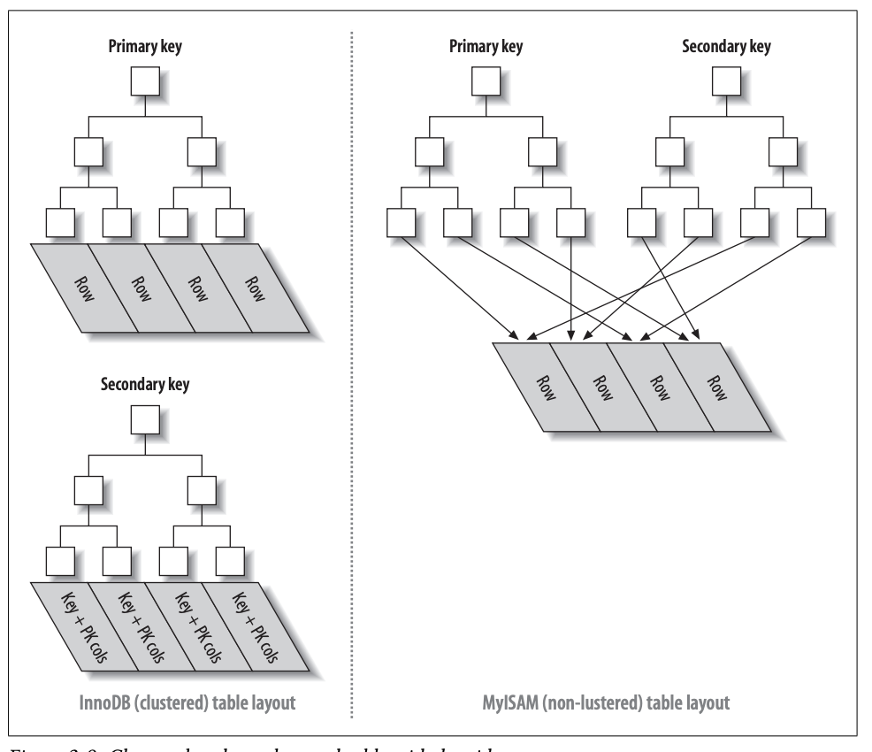

# 数据库的事务

## 隔离级别

何为隔离级别❓指的是一个事务的写，对另外一个事务的影响，特别是读，一共有下面几种隔离级别：

* Read Uncommitted(读未提交)：一个事务会读到另一个事务未提交的结果，如果另一个事务回滚，则又读到回滚前的，造成读的两次不一致。
* Read Committed(读已提交)：一个事务不会读到其他事务未提交的修改结果，也就是说如果其他事务提交，则就会读到提交的结果，但是这样会造成如下问题：
  * 如果其他事务插入了数据，本事务读到了插入的数据，则为幻读；
  * 如果其他事务修改了数据并提交，本事务读到了提交前后的数据，则为不可重复读。
* Repeatable-Read(可重复读)：一个事务里对某个数据的查询结果都是一样的，不管其他事务是否插入了或者修改了该数据。也就是解决了幻读（📢是部分解决）和不可重复读的问题，其实就是快照读。
* Serializable(串行化)：一个事务执行完，再去执行下一个事务，也就是相互完全不影响。

## 幻读，间隙锁

❓为什么说可重复读是部分解决幻读❓

如果当前事务是快照读，显然不会有问题，因为MVCC保证了其他事务的更新不会对本事务读产生影响。如果当前事务产生了当前读（update、select for update等），则会“读”到其他事务更新的结果（因为要保证数据一致，比如update，肯定不会按照快照去update）。

❓那么如何彻底解决幻读❓ 通过**间隙锁和next key lock**（RR级别生效），也就是锁区间，既然区间被锁住了，区间内的插入也会被阻塞，就避免了幻读。

InnoDB行锁有三种算法：

* record lock（行锁）: 锁定索引记录本身
* gap lock（间隙锁）: 在索引记录的间隙加锁，锁定一个范围，但是不包含记录本身
* next key lock: 锁定一个范围+记录本身(gap lock和record lock的结合)，可以防止幻读。

**举例**

|                                                   |
| ------------------------------------------------- |
| 事务1：select * from tbl where id > 16 for update |
| 事务2：insert into tbl (name) values ('test')     |

* 如果id有``10, 12, 29``，则RR级别下，next key lock的锁区间是：(负无穷,10],(11, 12],(12,29],(29,正无穷)，事务1会锁住(12,29],(29,正无穷)区间，事务2的insert会被block住，于是避免了幻读。
* 如果事务1为``select * from tbl where id=13 for update``，则[12,29)会被锁住。

## 快照读 MVCC

❓那么快照读是❓**MVCC**

MVCC即多版本并发控制，每行数据保留多份。不需要锁就可以实现高级别的事务隔离。通过多版本解决**幻读**。

每个事务分配一个ID，事务在执行第一条select时生成一个**read view**。read view包含：

* 未提交事务ID集合，下面例子中未提交ID集合是[4,7]
* 最小未提交事务ID，下例中是4
* 最大事务ID，下例中是7

| 事务ID | 状态   |
| ------ | ------ |
| 1      | 已提交 |
| 2      | 已提交 |
| 3      | 已提交 |
| 4      | 未提交 |
| 5      | 已提交 |
| 6      | 已提交 |
| 7      | 未提交 |

每条数据维护一个版本链（undo log），每个节点包括：事务ID，以及这个事务对此数据的改动情况。

1. 每次更新数据，版本链里新增一条记录，记录当前事务ID，值。

2. 每次删除数据，版本链里复制一条最新记录，记录当前事务ID，标记为删除。

3. 查找数据时，在版本链中从最新的记录开始找，如果事务在read view中已提交的ID中，则返回这条数据，否则继续查找。

# 索引

## 聚簇索引和非聚簇索引

* 聚簇索引：索引数据和表数据放在一起存储。B+树的叶子节点存储数据，辅助索引叶子节点存放的是主键，需要回一次表，才能查到数据，好处是：当数据页分裂时，辅助索引不需要变化，而非聚簇索引都要变。
* 非聚簇所以：索引和表数据分离。B+数的叶子节点存储数据的指针(索引)。

如下图所示，InnoDB只有一个聚簇索引(主键)，其余均为非聚簇索引(辅助键)。MyISAM均为非聚簇索引。



## 回表查询和索引覆盖

为了避免回表查询，可以用索引覆盖的方式，将需要查询的字段包含到索引上，

```sql
create table test_user (
	id bigint(20) unsigned not null auto_increment,
    uid bigint(20) unsigned not null,
    nickname varchar(20) not null,
    primary key(id),
    key(uid, nickname)
);

explain select nickname, uid from test_user where uid = 2;
```

联合索引遵守最左原则，mysql会根据最左边的字段建立B+数索引，然后依次按照剩余字段进行排序。索引如下：

1,2,3|1,2,4|1,3,3|2,3,4|2,3,5

## Mysql查询优化

至少是range级别：https://www.modb.pro/db/25959

SQL绑定变量：

在使用编程语言如JAVA对数据库进行查询时，SQL有两种写法，第一种写法是：

```sql
select * from user_tbl where name = 'a';
select * from user_tbl where name = 'b';
select * from user_tbl where name = 'c';
```

第二种写法是：

```sql
select * from user_tbl where name = ?
```

通过PreparedStatement进行预编译SQL，这种写法也称绑定变量，这种写法的好处是SQL解析只用了一次，即编译一次（编译好的结果存在数据库中），提升效率。

# SQL

* unique：每个表可以有多个unique约束，但是只能有一个primary key约束。被unique和primary key的字段都会作为mysql索引
* union: https://www.w3school.com.cn/sql/sql_union.asp
* in和exists的区别：[in适合从表小，exists适合主表小](https://blog.csdn.net/weixin_41979002/article/details/118730611)
* truncate table 命令将快速删除数据表中的所有记录，但保留数据表结构，truncate 命令删除的数据是不可以恢复的
* delete 命令删除的数据将存储在系统回滚段中，需要的时候，数据可以回滚恢复

**WITH AS**

```java
WITH TMP1 AS (SELECT * FROM USER1),
     TMP2 AS (SELECT * FROM USER2)
SELECT * FROM USER1, USER2;
```

# 分页

limit offset, N：扫描offset+N条数据，并把从offset开始的N条数据返回。连续分页查询的同时如果修改数据库，可能会产生查询数据丢失的情况，如下。可以通过增加修改时间戳来解决。

|                       |
| --------------------- |
| limit 0, 2(展示前2条) |
| 删除前2条数据的某一个 |
| limit 2, 2(数据丢失)  |

## 超大分页优化

log_tbl表特别大，service是非主键索引：

* **Bad case**: select * from log_tbl where service="xxx" limit 1000000, 5，这里需要回表1000005数据，返回5条，查询很慢。
* **Good case**: select * from log_tbl as a join (select id from log_tbl where service="xxx" limit 1000000, 5) as b where a.id = b.id; 这里只需要回表5条数据，大大缩短耗时。

# 锁

## 按照锁的粒度

* 行级锁：针对行加锁，粒度小，开销大，并发度高。
* 表级锁：针对表加锁，并发度低，不容易死锁。
  * lock table user read;
  * lock table user write;

**行锁是通过索引来实现的**。如果要想使用行锁，查询条件必须带上索引，否则使用的是表锁，并发度降低。

## 按照锁级别

* 共享锁(读锁)：和读写锁的读锁类似

  用法：select ... lock in share mode;

* 排他锁(写锁)：和读写锁的写锁类似

  用法：select ... for update;

## 乐观锁

乐观锁通过非阻塞的方式实现对共享资源的访问。
只支付一次：
``update order_tbl set pay_status=1 where id=1 and pay_status=0;``
可以用乐观锁实现对业务的加锁。

```
res = update lock_tbl set is_lock=true where is_lock=false and lock_id=xxx;
if (res == 0)
  return
执行业务 
update lock_tbl set is_lock=false where is_lock=true and lock_id=xxx;
```

## Mysql死锁和解决方案

InnoDB可以自行解决死锁

# 分布式事务

分布式事务的常用方法：

* 消息队列：业务可以异步重试完成，https://www.cnblogs.com/rjzheng/p/10115798.html
* TCC事务模型：业务同步完成，https://www.cnblogs.com/rjzheng/p/10164667.html


# Other

* ORM框架，数据库连接池：https://my.oschina.net/mengyuankan/blog/2664784
* JDBC事务：https://www.cnblogs.com/softidea/p/5877546.html ，https://www.marcobehler.com/guides/spring-transaction-management-transactional-in-depth
